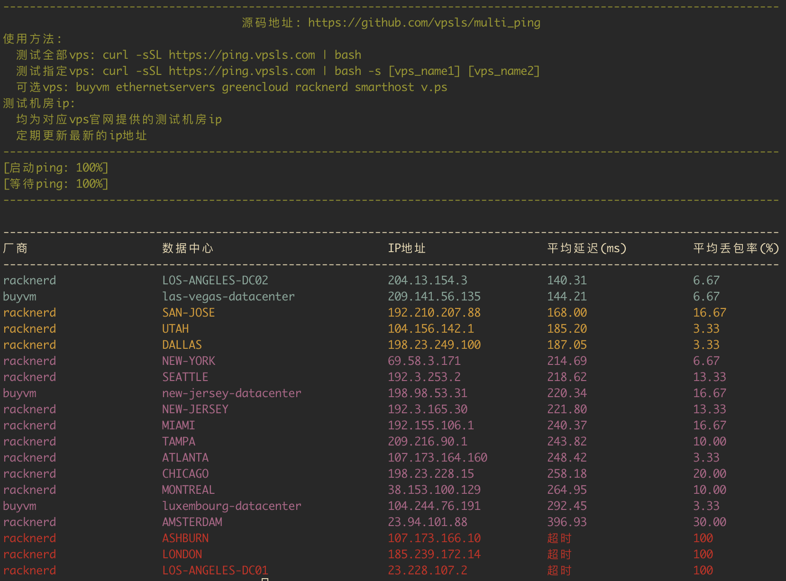

# multi_ping

## about

Ping multiple VPS test IP addresses simultaneously to assess the performance of each one.

## how to use

```sh
chmod 700 vpsping.sh
./vpsping.sh [product_1] [product_2] ...
```

or

```sh
curl -sSL https://ping.vpsls.com | bash
curl -sSL https://ping.vpsls.com | bash -s product_1 product_2 ...
```

Here are two examples:

`./vpsping.sh`


`./vpsping.sh racknerd buyvm`


