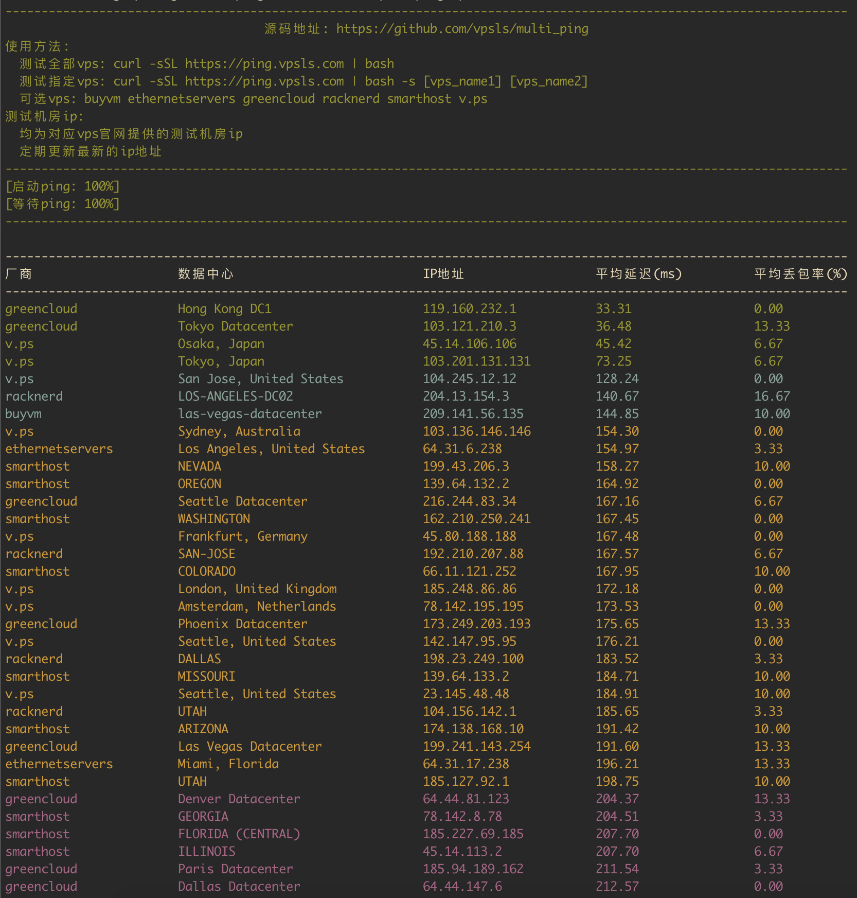

# multi_ping

## about

Ping multiple VPS test IP addresses simultaneously to assess the performance of each one.

## how to use

```sh
chmod 700 vpsping.sh
./vpsping.sh [product_1] [product_2] ...
```

or

```sh
curl -sSL https://github.com/vpsls/multi_ping/raw/main/vpsping.sh | bash
curl -sSL https://github.com/vpsls/multi_ping/raw/main/vpsping.sh | bash -s product_1 product_2 ...
```

Here is an example of the program's output:


